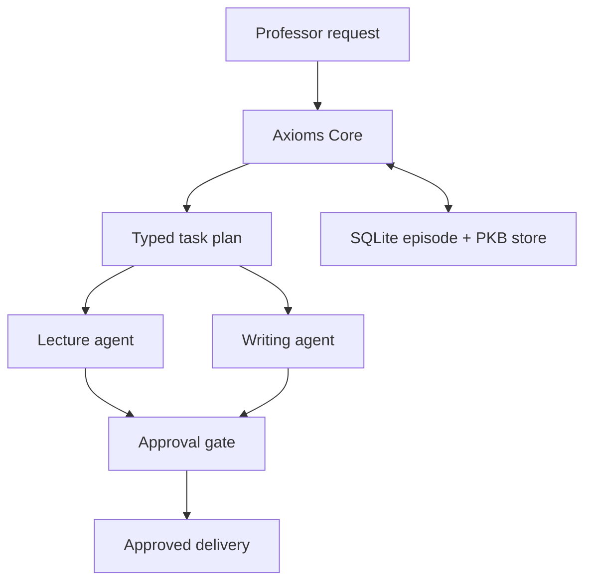

# Axioms AI System

A human-governed multi-agent workspace for research, teaching, and professional writing.

This repository implements the **Phase 1 Foundation MVP** from the architecture
specification. It deliberately starts with a small, auditable surface:

- Axioms Core converts an approved request into a typed task plan.
- The Lecture Design Agent produces a duration-accurate, reviewable lesson plan and DOCX
  export; Writing & Communication produces evidence-aware, author-reviewable drafts and DOCX exports.
- Every external or public-facing deliverable is held for explicit approval.
- SQLite stores task episodes and an approved Personal Knowledge Base (PKB).
- FastAPI exposes the service and Streamlit provides a lightweight review console.

It does **not** autonomously post online, send email, access student records, write to
GitHub, call paid LLM APIs, or claim to verify citations. Those capabilities remain
disabled until their individual integration, tests, permissions, and approval policy are
implemented.

## System Integration and Readiness

The Core now exposes the eight implemented specialist capabilities through `GET /agents` and a
truthful implementation/deferred-infrastructure report through `GET /system/readiness`. This
keeps the completed MVP auditable: Core routing, SQLite task episodes, FastAPI, Streamlit, Docker
configuration, and approval boundaries are implemented; Redis Streams, semantic retrieval,
LangGraph, live external connectors, and cloud deployment remain explicitly deferred. See
[docs/system_integration.md](docs/system_integration.md).

## Personal Knowledge Base Governance

`POST /feedback` records explicit per-delivery feedback without changing system preferences.
`POST /personal-kb/proposals` creates a pending preference proposal, and
`POST /personal-kb/proposals/{proposal_id}/decision` records the owner's approval or rejection.
Only approved proposals become visible through `GET /personal-kb/entries`. Student and personal
identifiers are rejected from KB records; implicit edit tracking, automated preference extraction,
and semantic retrieval remain deferred. See [docs/personal_kb.md](docs/personal_kb.md).

## Architecture



## Quick start

```bash
python -m venv .venv
# Windows PowerShell: .\.venv\Scripts\Activate.ps1
# macOS/Linux: source .venv/bin/activate
pip install -e ".[dev]"
uvicorn axioms.api:app --reload
```

In a second terminal:

```bash
streamlit run streamlit_app.py
```

Run validation:

```bash
pytest
ruff check .
```

## API example

```bash
curl -X POST http://127.0.0.1:8000/tasks \
  -H "Content-Type: application/json" \
  -d '{"goal":"Prepare a 75-minute graduate lecture on spectral graph theory", "audience":"MS mathematics", "deadline":"2026-10-02"}'
```

Use `GET /tasks/{task_id}` to inspect the plan and drafts. `POST /tasks/{task_id}/approval`
requires a recorded human decision before a pending deliverable is marked approved.

## Lecture Design Agent

`POST /lecture-plans` accepts a topic, duration, learner profile, and learning outcomes.
It returns a timed plan following the teaching sequence **intuition → formal development
→ worked example → guided application → retrieval check**. The segments always sum to the
requested duration. `POST /lecture-plans/docx` returns the reviewed plan as a DOCX file.
See [docs/lecture_agent.md](docs/lecture_agent.md) for the full contract.

## Writing & Communication Agent

`POST /writing-drafts` creates an author-reviewable framework for emails, reports, paper
sections, recommendation letters, grant sections, and public articles. It requires
author-verified facts, distinguishes evidence checking from similarity review, and never
sends or publishes content. `POST /writing-drafts/docx` exports the draft as a DOCX file.
See [docs/writing_agent.md](docs/writing_agent.md) for the full contract.

## Research Agent

`POST /research-briefs` creates a claim-level evidence ledger from author-entered source
records. Only sources marked `claim_verified` can support constrained factual synthesis;
unverified and rejected records remain visible in the audit trail. DOCX and safe BibTeX
exports are available at `POST /research-briefs/docx` and `POST /research-briefs/bibtex`.
See [docs/research_agent.md](docs/research_agent.md) for verification states and connector limits.

## Assessment Design Agent

`POST /assessment-blueprints` builds a source-bounded instructor blueprint that maps each
question framework to a learning outcome, Bloom level, difficulty, mark allocation, rubric,
and qualitative AI-resilience review. Separate DOCX endpoints produce student-facing and
instructor-facing materials, preventing rubrics and solution guides from reaching students.
See [docs/assessment_agent.md](docs/assessment_agent.md) for the full governance contract.

## Content Creation Agent

`POST /content-packages` produces reviewable educational-video, course-module, or workshop
plans with title options, timed segments, description framework, thumbnail brief, bilingual
markers, accessibility checks, and accuracy controls. `POST /content-packages/docx` exports
the package as a DOCX. Public publication remains blocked pending author approval. See
[docs/content_agent.md](docs/content_agent.md) for the full contract.

## Social Media Agent

`POST /social-media-packages` creates platform-native draft packs for LinkedIn, Instagram,
X, TikTok, and WhatsApp, together with accessibility notes and a proposed review calendar.
It requires author-supplied verified facts and checks a 48-hour same-topic cooldown for each
platform. `POST /social-media-packages/docx` exports the review package. It has no account
connection, scheduling, messaging, scraping, or publishing capability. See
[docs/social_media_agent.md](docs/social_media_agent.md) for the governance contract.

## STEM AI Portfolio Agent

`POST /portfolio-packages` creates an evidence-bound plan for a research portfolio case study:
repository structure, README sections, reproducibility checklist, data-provenance checks, and a
constrained impact summary. It accepts only author-verified claims and rejects public-repository
plans containing proprietary, restricted, or unknown-access data. `POST /portfolio-packages/docx`
exports the package. It cannot create, modify, push to, or publish a GitHub repository. See
[docs/portfolio_agent.md](docs/portfolio_agent.md) for the full contract.

## AutoEval Agent

`POST /autoeval-reports` generates a deterministic review report for a declared artifact. It checks
required text markers, evidence-marker presence, declared sensitive-data status, public-delivery
gates, and records a SHA-256 audit hash. The resulting percentage is a review signal only: it does
not establish factual accuracy or approve release. `POST /autoeval-reports/docx` exports the report.
AutoEval cannot reconfigure agents, publish, schedule, or make external changes. See
[docs/autoeval_agent.md](docs/autoeval_agent.md) for its exact scope.

## Deployment

Local Docker deployment and the GitHub release checklist are in
[docs/deployment.md](docs/deployment.md). Start with local Docker Compose; do not deploy
with real keys or enable external integrations until the security checklist is complete.

Before local container startup, run `python scripts/verify_release.py --root .`. The verifier is
structural and offline: it confirms the release files, health-gated Compose dependency, persistent
SQLite volume, conservative disabled-LLM default, and project-specific deployment documentation.

## Roadmap

| Phase | Scope | Gate |
| --- | --- | --- |
| 1 | Core, lecture/writing agents, SQLite memory, review UI | Unit tests + manual approval workflow |
| 2 | Research/assessment, verified source connectors, Redis and retrieval | Connector contract tests + evidence audit |
| 3 | Content/social/portfolio integrations | Per-integration permission and dry-run tests |
| 4 | Evaluation, enterprise security, cloud operations | Threat model, backup/restore and acceptance tests |

## Safety principles

- Human approval precedes any external action.
- Student identifiers and grades are not persistent memory.
- A source is never labelled verified without a recorded verification result.
- PKB changes are proposals until approved by the owner.
- Secrets remain in the deployment environment, never in Git.
