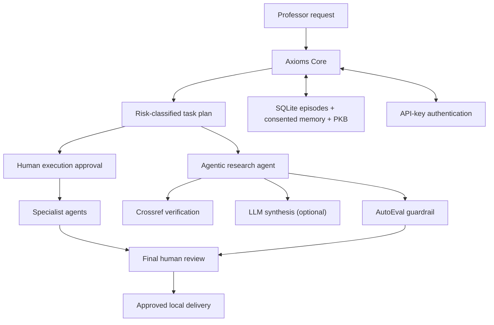

# Axioms AI System

A human-governed multi-agent workspace for research, teaching, and professional writing.

## What it does

Axioms is a **genuinely agentic** academic-AI system. It combines deterministic
governance (typed task plans, risk-tier classification, human approval gates) with
real tool use and optional LLM synthesis:

- **Axioms Core runtime** persists a typed task plan, records an approval, runs
  bounded local drafting, and returns the resulting drafts for final human review.
  Each lifecycle transition and agent dispatch is recorded in an auditable trace.
- **Eight specialist agents** produce review-first drafts: lecture plans, writing
  drafts, evidence-first research briefs, assessment blueprints, content packages,
  social-media drafts, portfolio plans, and AutoEval quality reports.
- **Agentic research agent** verifies source metadata against Crossref (a real
  external bibliographic registry), synthesises verified claims through a
  constrained LLM prompt, and runs the output through an AutoEval guardrail —
  all captured in an auditable agent trace.
- **Agentic assessment design** retains a deterministic, source-scoped
  blueprint and can add a bounded LLM review for the instructor. It never
  generates student-facing questions, answers, or worked solutions; release
  remains blocked pending instructor review.
- **Agentic content creation** retains a deterministic content package and can
  add a bounded internal editorial review. It neither creates final publication
  copy nor performs publication actions; editorial approval remains required.
- **Agentic social-media review** retains deterministic platform drafts and can
  add a bounded internal editorial review. It cannot schedule, upload, publish,
  message, or authorize activity on any social platform.
- **Agentic portfolio review** retains an evidence-bound portfolio package and
  can add a bounded readiness review. It cannot create repositories, change
  repository visibility, commit, push, deploy, or publish anything.
- **Research discovery** can use Tavily as a bounded, read-only search tool to
  collect unverified source candidates with retrieval provenance. Candidates
  cannot be cited or synthesised until they pass the existing verification flow.
- **arXiv discovery** adds cached, rate-limited, read-only preprint candidates
  with Atom provenance. A preprint is neither peer-reviewed evidence nor a
  verified claim and remains ineligible for synthesis until separately checked.
- **Semantic Scholar discovery** adds keyed, cached, rate-limited, read-only
  bibliographic candidates. Its metadata and citation counts are discovery
  signals only, not evidence of quality, publication status, or claim validity.
- **Durable local dispatch** queues only approved local tasks in SQLite with an
  idempotency key, atomic leased worker claim, bounded retry, and dead-letter state.
  A manually invoked local worker runs deterministic drafts only; it cannot
  perform external actions. An expired worker lease requeues only the job within
  its retry budget; task recovery remains a separate human-confirmed action.
- **Versioned task graphs** attach a deterministic `routing.v1` graph and hash
  to every task. Dependencies are validated for missing nodes and cycles before
  approval. `parallel=true` may run only independent local draft nodes in a
  recorded layer; it preserves deterministic result ordering, remains opt-in,
  and never enables external actions. It uses a conservative configurable cap
  of 1–4 local workers (default 2); default execution and the durable worker
  remain sequential.
- **Cooperative local cancellation** lets a named human cancel an approved task
  immediately, or request a running task to stop at its next persisted graph
  layer. Partial drafts are discarded; cancellation creates no external action.
- **Interrupted task recovery** requires a named human to attest that the prior
  local execution has stopped. It discards any partial work and returns the
  task to pending approval; it never resumes execution automatically.
- **Cross-agent AutoEval** produces one deterministic, hash-linked review of a
  completed task's specialist drafts. It checks declared draft-marker contracts
  and consolidates review signals without changing drafts, granting approval,
  or triggering publication, scheduling, messaging, or other external action.
- **Similarity screening** compares a draft only against texts the reviewer
  supplies, returning transparent overlap signals for human review. It is not a
  plagiarism verdict, originality determination, or web-wide search.
- **API-key authentication** with named-key principal resolution, so approver
  identity is derived from the authenticated key rather than self-asserted.
- **LLM provider seam** supporting Anthropic, OpenAI, or disabled (the safe
  default). The system degrades gracefully with no LLM configured — all
  deterministic agents work without one.
- **SQLite** stores task episodes, a consented episodic-memory ledger, and an
  approved Personal Knowledge Base (PKB). Episodic memory retains only
  owner-approved, non-sensitive task summaries — never draft content by default.
  An owner can delete a searchable entry; deletion retains only a minimal audit tombstone.
- **FastAPI** exposes the service; **Streamlit** provides a review console.

Every external or public-facing deliverable is held for explicit human approval.
HIGH-risk tasks (sensitive educational data) are **blocking** — they require the
data-governance issue to be resolved before approval can proceed.

## Architecture



## Quick start

```bash
python -m venv .venv
# Windows PowerShell: .\.venv\Scripts\Activate.ps1
# macOS/Linux: source .venv/bin/activate
pip install -e ".[dev]"
uvicorn axioms.api:app --reload
```

In a second terminal:

```bash
streamlit run streamlit_app.py
```

Run validation:

```bash
pytest
ruff check .
```

## Configuration

Copy `.env.example` and set the values appropriate to your deployment:

| Variable | Purpose | Default |
| --- | --- | --- |
| `AXIOMS_API_KEY` | Single shared API secret (legacy mode) | unset (open-dev) |
| `AXIOMS_API_KEYS` | JSON object mapping principal names to secrets, e.g. `{"Dr Aslam": "key1"}` | unset |
| `AXIOMS_APPROVAL_MODE` | `strict` (all drafts gated) or `risk_based` (low-risk planned directly) | `strict` |
| `AXIOMS_MAX_PARALLEL_WORKERS` | Local cap for explicit `parallel=true` drafting (1–4) | `2` |
| `AXIOMS_LLM_PROVIDER` | `disabled`, `anthropic`, or `openai` | `disabled` |
| `AXIOMS_LLM_MODEL` | Model override (e.g. `claude-3-5-sonnet-latest`) | provider default |
| `ANTHROPIC_API_KEY` | Required when provider is `anthropic` | — |
| `OPENAI_API_KEY` | Required when provider is `openai` | — |
| `CROSSREF_MAILTO` | Polite Crossref identification (recommended) | unset |
| `TAVILY_API_KEY` | Enables read-only research discovery | unset (disabled) |

To enable LLM-powered synthesis in the agentic research agent, install the
optional dependencies: `pip install -e ".[agentic]"`.

## API example

```bash
# Create a task (requires X-API-Key header when auth is configured)
curl -X POST http://127.0.0.1:8000/tasks \
  -H "Content-Type: application/json" \
  -H "X-API-Key: your-secret" \
  -d '{"goal":"Prepare a 75-minute graduate lecture on spectral graph theory", "audience":"MS mathematics"}'

# Approve task execution with named approver (required)
curl -X POST http://127.0.0.1:8000/tasks/{task_id}/approval \
  -H "Content-Type: application/json" \
  -H "X-API-Key: your-secret" \
  -d '{"decision":"approve", "approved_by":"Dr Aslam", "note":"Reviewed"}'

# Run the approved local plan. This creates review-only drafts; it performs no external action.
curl -X POST http://127.0.0.1:8000/tasks/{task_id}/execute \
  -H "X-API-Key: your-secret"

# Optional: run only independent local graph-layer drafts concurrently.
# Result ordering remains deterministic; external actions remain unavailable.
curl -X POST "http://127.0.0.1:8000/tasks/{task_id}/execute?parallel=true" \
  -H "X-API-Key: your-secret"

# Stop an approved task immediately, or request a running task to stop at its
# next safe graph-layer checkpoint. Partial drafts are discarded.
curl -X POST http://127.0.0.1:8000/tasks/{task_id}/cancel \
  -H "Content-Type: application/json" \
  -H "X-API-Key: your-secret" \
  -d '{"requested_by":"Dr Aslam", "note":"Scope changed"}'

# Recover only after confirming a local execution was interrupted and has stopped.
# A fresh execution approval is required before the task can run again.
curl -X POST http://127.0.0.1:8000/tasks/{task_id}/recover \
  -H "Content-Type: application/json" \
  -H "X-API-Key: your-secret" \
  -d '{"recovered_by":"Dr Aslam", "confirm_execution_stopped":true, "note":"Local worker restarted"}'

# Approve or reject the resulting drafts in a final human review.
curl -X POST http://127.0.0.1:8000/tasks/{task_id}/approval \
  -H "Content-Type: application/json" \
  -H "X-API-Key: your-secret" \
  -d '{"decision":"approve", "approved_by":"Dr Aslam", "note":"Final review complete"}'

# Propose the completed non-sensitive episode for memory; a second decision is required.
curl -X POST http://127.0.0.1:8000/tasks/{task_id}/memory-proposal \
  -H "X-API-Key: your-secret"

# Approve the memory proposal, then retrieve approved episodes by keyword.
curl -X POST http://127.0.0.1:8000/episodic-memory/proposals/{proposal_id}/decision \
  -H "Content-Type: application/json" \
  -H "X-API-Key: your-secret" \
  -d '{"decision":"approve", "approved_by":"Dr Aslam", "note":"Retain this reusable planning context"}'

# Delete one searchable memory entry by ID; its content is removed.
curl -X DELETE http://127.0.0.1:8000/episodic-memory/{memory_id} \
  -H "Content-Type: application/json" \
  -H "X-API-Key: your-secret" \
  -d '{"deleted_by":"Dr Aslam", "note":"No longer needed"}'

# Screen supplied text against a local comparison set; review any flagged overlap.
curl -X POST http://127.0.0.1:8000/similarity/screen \
  -H "Content-Type: application/json" \
  -H "X-API-Key: your-secret" \
  -d @similarity_request.json

# Run the agentic research agent (works with or without an LLM configured)
curl -X POST http://127.0.0.1:8000/research-briefs/agentic \
  -H "Content-Type: application/json" \
  -H "X-API-Key: your-secret" \
  -d @research_request.json

# Discover unverified research candidates (requires TAVILY_API_KEY)
curl -X POST http://127.0.0.1:8000/research/discover \
  -H "Content-Type: application/json" \
  -H "X-API-Key: your-secret" \
  -d '{"query":"fuzzy similarity methods for drug-target interaction prediction", "max_results":5}'
```

Use `GET /tasks/{task_id}` to inspect the plan, lifecycle state, drafts, and agent trace.
Use `GET /health` to verify authentication posture and provider status.
Use `GET /system/readiness` for a full component report.

## Specialist agents

| Agent | Endpoint | DOCX |
| --- | --- | --- |
| Lecture Design | `POST /lecture-plans` | `POST /lecture-plans/docx` |
| Writing & Communication | `POST /writing-drafts` | `POST /writing-drafts/docx` |
| Research (deterministic) | `POST /research-briefs` | `POST /research-briefs/docx` |
| Research (agentic) | `POST /research-briefs/agentic` | — |
| Research discovery (read-only) | `POST /research/discover` | — |
| arXiv preprint discovery (read-only) | `POST /research/discover/arxiv` | — |
| Semantic Scholar discovery (read-only) | `POST /research/discover/semantic-scholar` | — |
| Durable local dispatch | `POST /tasks/{task_id}/dispatch`; `POST /dispatch/run-one` | `POST /dispatch/jobs/claim`; `POST /dispatch/jobs/{job_id}/finish` |
| Similarity screening (local review signal) | `POST /similarity/screen` | — |
| Assessment Design | `POST /assessment-blueprints`; `POST /assessment-blueprints/agentic` | student + instructor DOCX; instructor-only review |
| Content Creation | `POST /content-packages`; `POST /content-packages/agentic` | `POST /content-packages/docx`; internal editorial review |
| Social Media | `POST /social-media-packages`; `POST /social-media-packages/agentic` | `POST /social-media-packages/docx`; internal editorial review |
| STEM AI Portfolio | `POST /portfolio-packages`; `POST /portfolio-packages/agentic` | `POST /portfolio-packages/docx`; internal readiness review |
| AutoEval | `POST /autoeval-reports` | `POST /autoeval-reports/docx` |
| Cross-agent AutoEval | `POST /tasks/{task_id}/cross-agent-autoeval` after local execution | Review-only task deliverable; final human review still required |

## System integration and readiness

`GET /agents` lists the implemented specialist capabilities. `GET /system/readiness`
returns a truthful component report — implemented components (Core runtime,
authentication, LLM seam, bounded scholarly discovery, agentic research, durable local dispatch, local deployment) and
deferred infrastructure (Redis, semantic retrieval, LangGraph, external connectors,
cloud deployment).

## Personal Knowledge Base governance

`POST /feedback` records per-delivery feedback. `POST /personal-kb/proposals`
creates a pending preference proposal; `POST /personal-kb/proposals/{proposal_id}/decision`
records approval or rejection. Only approved proposals appear in `GET /personal-kb/entries`.
Student and personal identifiers are rejected from KB records.

## Deployment

Local Docker deployment and the release checklist are in
[docs/deployment.md](docs/deployment.md). Start with Docker Compose; do not deploy
with real keys or enable external integrations until the security checklist is complete.

## Safety principles

- Human approval precedes any external action.
- HIGH-risk tasks are blocking — the data-governance issue must be resolved before approval.
- Student identifiers and grades are not persistent memory.
- A source is never labelled verified without a recorded verification result.
- LLM synthesis is constrained to verified claims only; the deterministic AutoEval
  guardrail checks that the output cites every verified source.
- PKB changes are proposals until approved by the owner.
- Episodic memory is opt-in per completed task; HIGH-risk episodes and sensitive text are rejected.
- Similarity scores are review signals only; academic-integrity decisions remain human decisions.
- Secrets remain in the deployment environment, never in Git.
- The system defaults to disabled LLM and strict approval mode — safety is the
  starting position, not an opt-in.
