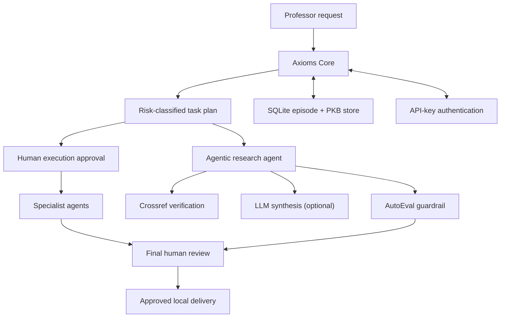

# Axioms AI System

A human-governed multi-agent workspace for research, teaching, and professional writing.

## What it does

Axioms is a **genuinely agentic** academic-AI system. It combines deterministic
governance (typed task plans, risk-tier classification, human approval gates) with
real tool use and optional LLM synthesis:

- **Axioms Core runtime** persists a typed task plan, records an approval, runs
  bounded local drafting, and returns the resulting drafts for final human review.
  Each lifecycle transition and agent dispatch is recorded in an auditable trace.
- **Eight specialist agents** produce review-first drafts: lecture plans, writing
  drafts, evidence-first research briefs, assessment blueprints, content packages,
  social-media drafts, portfolio plans, and AutoEval quality reports.
- **Agentic research agent** verifies source metadata against Crossref (a real
  external bibliographic registry), synthesises verified claims through a
  constrained LLM prompt, and runs the output through an AutoEval guardrail —
  all captured in an auditable agent trace.
- **API-key authentication** with named-key principal resolution, so approver
  identity is derived from the authenticated key rather than self-asserted.
- **LLM provider seam** supporting Anthropic, OpenAI, or disabled (the safe
  default). The system degrades gracefully with no LLM configured — all
  deterministic agents work without one.
- **SQLite** stores task episodes and an approved Personal Knowledge Base (PKB).
- **FastAPI** exposes the service; **Streamlit** provides a review console.

Every external or public-facing deliverable is held for explicit human approval.
HIGH-risk tasks (sensitive educational data) are **blocking** — they require the
data-governance issue to be resolved before approval can proceed.

## Architecture



## Quick start

```bash
python -m venv .venv
# Windows PowerShell: .\.venv\Scripts\Activate.ps1
# macOS/Linux: source .venv/bin/activate
pip install -e ".[dev]"
uvicorn axioms.api:app --reload
```

In a second terminal:

```bash
streamlit run streamlit_app.py
```

Run validation:

```bash
pytest
ruff check .
```

## Configuration

Copy `.env.example` and set the values appropriate to your deployment:

| Variable | Purpose | Default |
| --- | --- | --- |
| `AXIOMS_API_KEY` | Single shared API secret (legacy mode) | unset (open-dev) |
| `AXIOMS_API_KEYS` | JSON object mapping principal names to secrets, e.g. `{"Dr Aslam": "key1"}` | unset |
| `AXIOMS_APPROVAL_MODE` | `strict` (all drafts gated) or `risk_based` (low-risk planned directly) | `strict` |
| `AXIOMS_LLM_PROVIDER` | `disabled`, `anthropic`, or `openai` | `disabled` |
| `AXIOMS_LLM_MODEL` | Model override (e.g. `claude-3-5-sonnet-latest`) | provider default |
| `ANTHROPIC_API_KEY` | Required when provider is `anthropic` | — |
| `OPENAI_API_KEY` | Required when provider is `openai` | — |
| `CROSSREF_MAILTO` | Polite Crossref identification (recommended) | unset |

To enable LLM-powered synthesis in the agentic research agent, install the
optional dependencies: `pip install -e ".[agentic]"`.

## API example

```bash
# Create a task (requires X-API-Key header when auth is configured)
curl -X POST http://127.0.0.1:8000/tasks \
  -H "Content-Type: application/json" \
  -H "X-API-Key: your-secret" \
  -d '{"goal":"Prepare a 75-minute graduate lecture on spectral graph theory", "audience":"MS mathematics"}'

# Approve task execution with named approver (required)
curl -X POST http://127.0.0.1:8000/tasks/{task_id}/approval \
  -H "Content-Type: application/json" \
  -H "X-API-Key: your-secret" \
  -d '{"decision":"approve", "approved_by":"Dr Aslam", "note":"Reviewed"}'

# Run the approved local plan. This creates review-only drafts; it performs no external action.
curl -X POST http://127.0.0.1:8000/tasks/{task_id}/execute \
  -H "X-API-Key: your-secret"

# Approve or reject the resulting drafts in a final human review.
curl -X POST http://127.0.0.1:8000/tasks/{task_id}/approval \
  -H "Content-Type: application/json" \
  -H "X-API-Key: your-secret" \
  -d '{"decision":"approve", "approved_by":"Dr Aslam", "note":"Final review complete"}'

# Run the agentic research agent (works with or without an LLM configured)
curl -X POST http://127.0.0.1:8000/research-briefs/agentic \
  -H "Content-Type: application/json" \
  -H "X-API-Key: your-secret" \
  -d @research_request.json
```

Use `GET /tasks/{task_id}` to inspect the plan, lifecycle state, drafts, and agent trace.
Use `GET /health` to verify authentication posture and provider status.
Use `GET /system/readiness` for a full component report.

## Specialist agents

| Agent | Endpoint | DOCX |
| --- | --- | --- |
| Lecture Design | `POST /lecture-plans` | `POST /lecture-plans/docx` |
| Writing & Communication | `POST /writing-drafts` | `POST /writing-drafts/docx` |
| Research (deterministic) | `POST /research-briefs` | `POST /research-briefs/docx` |
| Research (agentic) | `POST /research-briefs/agentic` | — |
| Assessment Design | `POST /assessment-blueprints` | student + instructor DOCX |
| Content Creation | `POST /content-packages` | `POST /content-packages/docx` |
| Social Media | `POST /social-media-packages` | `POST /social-media-packages/docx` |
| STEM AI Portfolio | `POST /portfolio-packages` | `POST /portfolio-packages/docx` |
| AutoEval | `POST /autoeval-reports` | `POST /autoeval-reports/docx` |

## System integration and readiness

`GET /agents` lists the implemented specialist capabilities. `GET /system/readiness`
returns a truthful component report — implemented components (Core runtime,
authentication, LLM seam, Crossref tool, agentic research, local deployment) and
deferred infrastructure (Redis, semantic retrieval, LangGraph, external connectors,
cloud deployment).

## Personal Knowledge Base governance

`POST /feedback` records per-delivery feedback. `POST /personal-kb/proposals`
creates a pending preference proposal; `POST /personal-kb/proposals/{proposal_id}/decision`
records approval or rejection. Only approved proposals appear in `GET /personal-kb/entries`.
Student and personal identifiers are rejected from KB records.

## Deployment

Local Docker deployment and the release checklist are in
[docs/deployment.md](docs/deployment.md). Start with Docker Compose; do not deploy
with real keys or enable external integrations until the security checklist is complete.

## Safety principles

- Human approval precedes any external action.
- HIGH-risk tasks are blocking — the data-governance issue must be resolved before approval.
- Student identifiers and grades are not persistent memory.
- A source is never labelled verified without a recorded verification result.
- LLM synthesis is constrained to verified claims only; the deterministic AutoEval
  guardrail checks that the output cites every verified source.
- PKB changes are proposals until approved by the owner.
- Secrets remain in the deployment environment, never in Git.
- The system defaults to disabled LLM and strict approval mode — safety is the
  starting position, not an opt-in.
